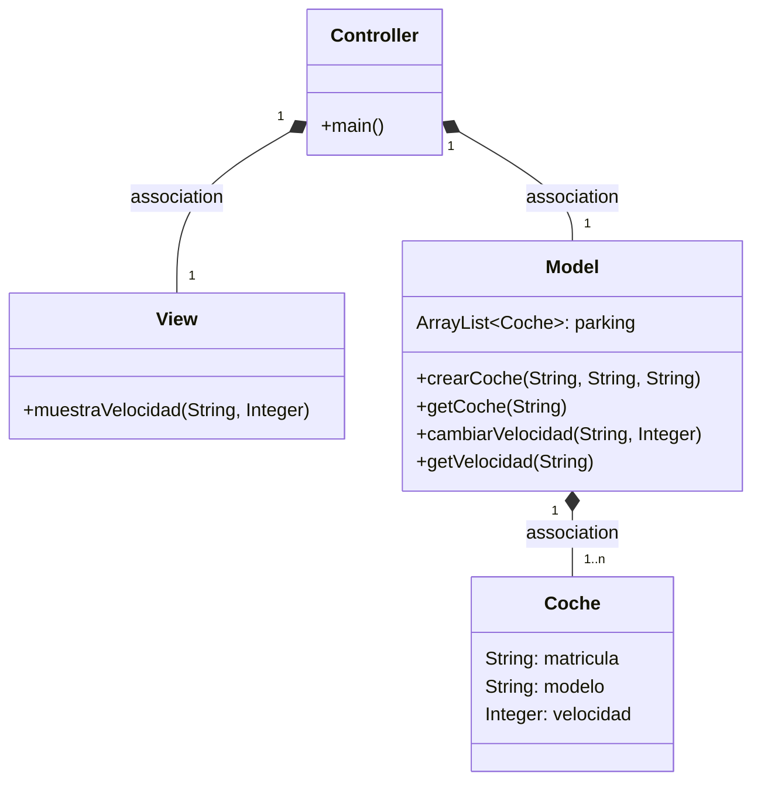
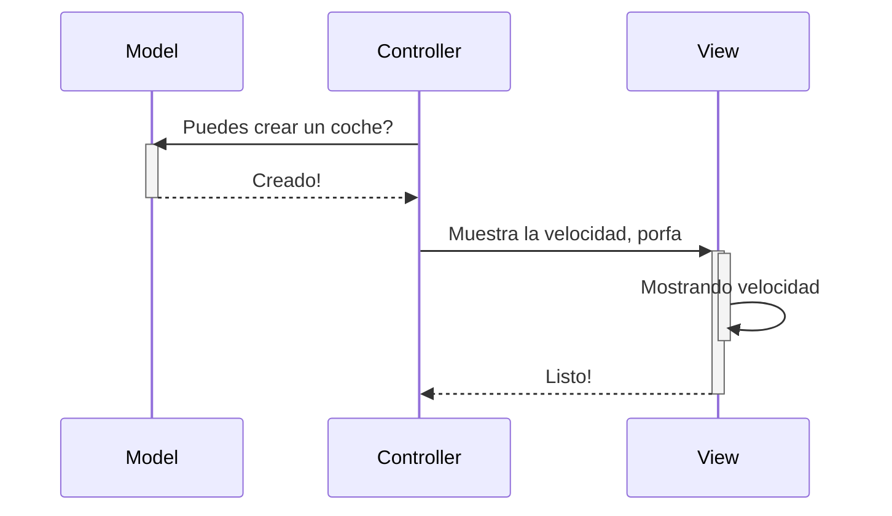
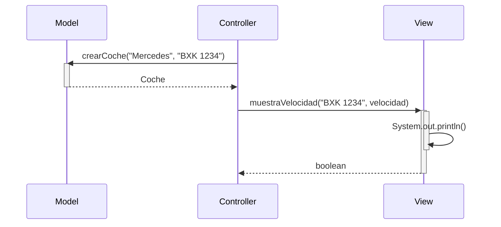

# Recu 2eval COD
### Aqui voy a poner paso a paso lo que hice duranre el examen:

1. Lo primero es crear una nueva rama llamada **readme** y en ella este Readme.md para escribir los pasos.
2. Lo siguiente es hacer los test unitarios correspondientes al codigo de MVC y por cada uno un issue y cerrarlo con su pr correspondiente:

### Primer test:

# Arquitectura MVC

Aplicación que trabaja con objetos coches, modifica la velocidad y la muestra

---
## Diagrama de clases:

---

## Diagrama de Secuencia

Ejemplo básico del procedimiento, sin utilizar los nombres de los métodos

El mismo diagrama con los nombres de los métodos

